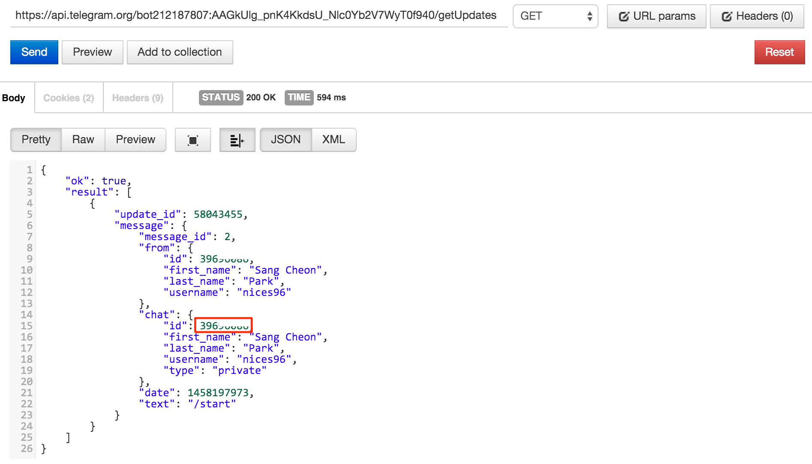
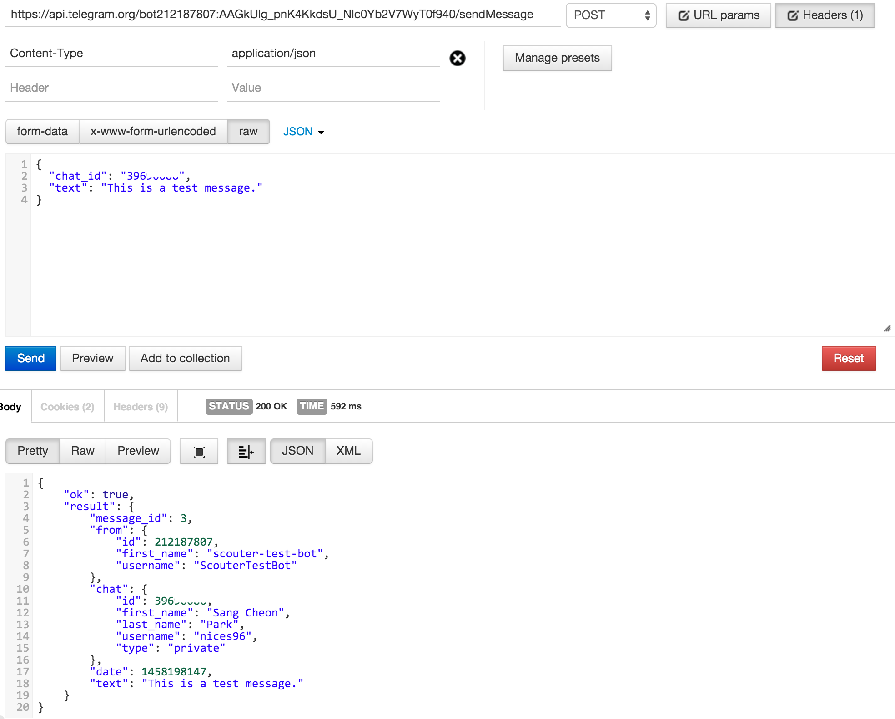

# scouter-plugin-server-alert-telegram
### Scouter server plugin to send a alert via telegram

- 본 프로젝트는 스카우터 서버 플러그인으로써 서버에서 발생한 Alert 메시지를 Telegram으로 전송하는 역할을 한다.
- 현재 지원되는 Alert의 종류는 다음과 같다.
	- Agent의 CPU (warning / fatal)
	- Agent의 Memory (warning / fatal)
	- Agent의 Disk (warning / fatal)
	- 신규 Agent 연결
	- Agent의 연결 해제 (연결 해제된 Agent의 재접속은 Scouter Server 내부 이슈로 지연)

### Properties (스카우터 서버 설치 경로 하위의 conf/scouter.conf)
* **_ext\_plugin\_telegram\_send\_alert_** : Telegram 메시지 발송 여부 (true / false) - 기본 값은 false
* **_ext\_plugin\_telegram\_debug_** : 로깅 여부 - 기본 값은 false
* **_ext\_plugin\_telegram\_level_** : 수신 레벨(0 : INFO, 1 : WARN, 2 : ERROR, 3 : FATAL) - 기본 값은 0
* **_ext\_plugin\_telegram\_bot\_token_** : Telegram Bot Token
* **_ext\_plugin\_telegram\_chat\_id_** : chat_id(Integer) 또는 채널 이름(String)

* Example
```
# External Interface (Telegram)
ext_plugin_telegram_send_alert=true
ext_plugin_telegram_debug=true
ext_plugin_telegram_level=0
ext_plugin_telegram_bot_token=185780011:AAGVaPyWCoZ8y1mHZEK1jFmbLwpcjlsJoJY
ext_plugin_telegram_chat_id=@ScouterDemoChannel
```

### dependencies
* Project
    - scouter.common
    - scouter.server
* Library
    - commons-codec-1.9.jar
    - commons-logging-1.2.jar
    - gson-2.6.2.jar
    - httpclient-4.5.2.jar
    - httpcore-4.4.4.jar
    
### Build & Deploy
* Build
    - 프로젝트 내의 build.xml을 실행한다.
    
* Deploy
    - 빌드 후 프로젝트 하위에 out 디렉토리가 생기며, 디펜던시 라이브러리와 함께 scouter-plugin-server-alert-telegram.jar 파일을 복사하여 스카우터 서버 설치 경로 하위의 lib/ 폴더에 저장한다.
    
## Appendix
##### Telegram 데모 채널 #####
* https://telegram.me/ScouterDemoChannel 을 통해 Telegram 봇을 이용한 메시지 수신 기능을 확인할 수 있습니다.

##### Telegram Bot 생성 #####
* Telegram App에서 BotFather를 검색합니다.
>

* BotFather를 통해 수행할 수 있는 명령어는 다음과 같습니다.
>

* /newbot을 입력하여 새로운 봇을 생성합니다.
>

##### Telegram chat_id 조회 #####
* Telegram App에서 생성된 Bot을 검색합니다.
>

* 시작을 누릅니다.
>
>

* 브라우져에서 https://api.telegram.org/bot{BOT_TOKEN}/getUpdates 를 호출합니다.
>

* chat id 값을 이용하여 대화창으로 메시지를 전송할 수 있습니다. (공개 채널의 경우 @{channelName}으로 메시지 전송 가능)
>
>